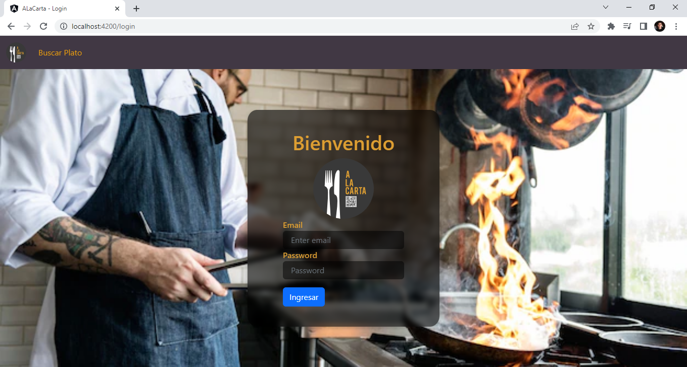
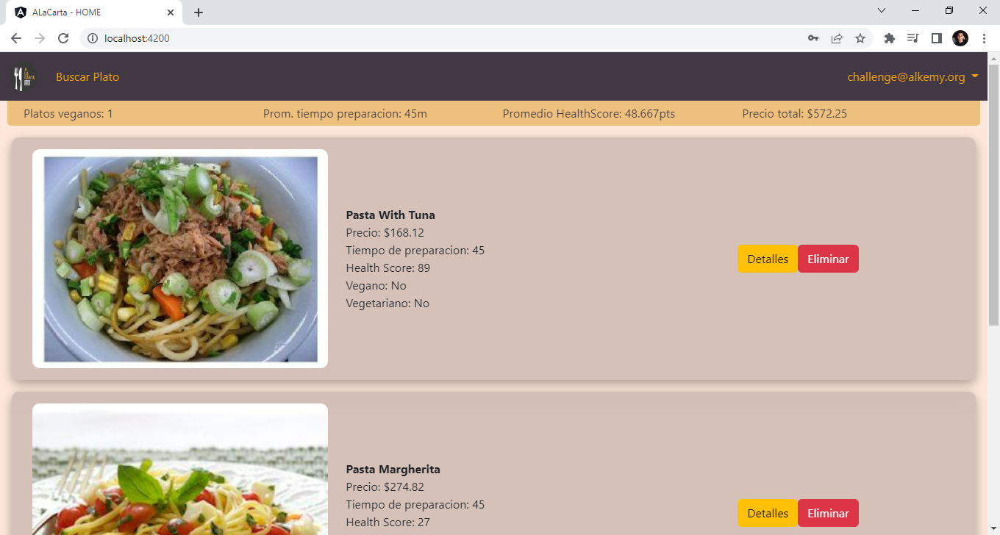
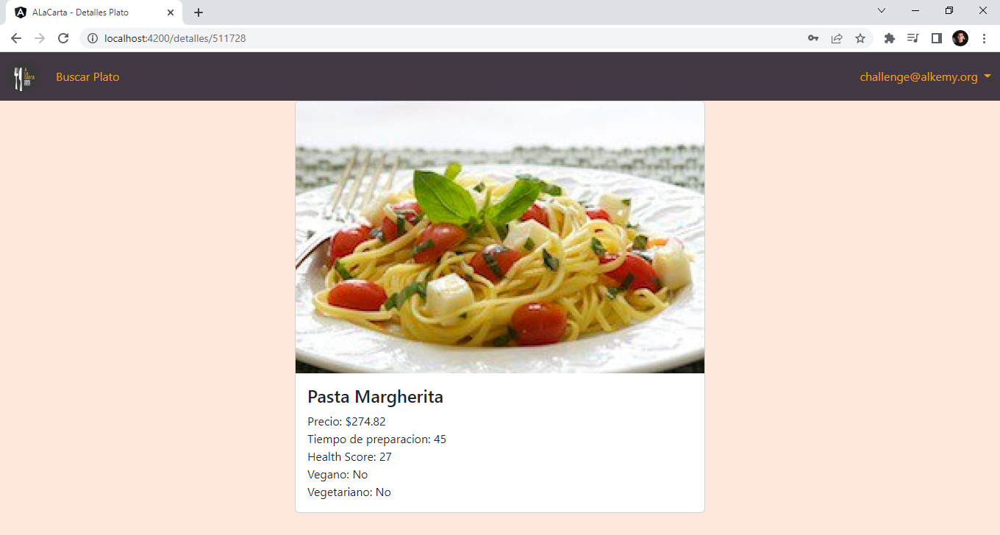
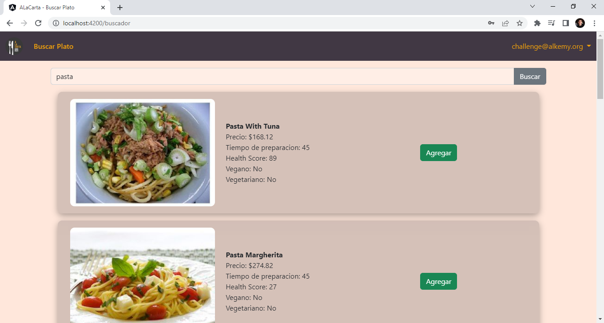

# A La Carta - Angular challenge

A brief description of what this project does and who it's for


## Run Locally

Clone the project

```bash
  git clone https://github.com/PedroS2001/AngularChallenge-Alkemy.git
```

Go to the project directory

```bash
  cd AngularChallenge-Alkemy
```

Install dependencies

```bash
  npm install
```

Start the server

```bash
  ng serve
```


## Screenshots

Login Page



Home Page



Detalles Page



Buscar Page


